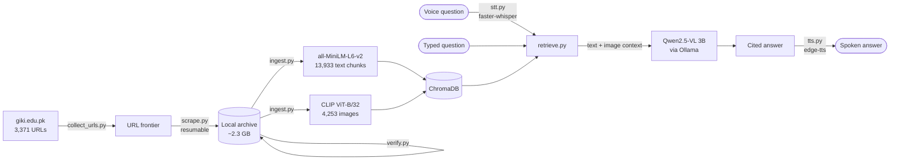

# Multimodal RAG over a 3,368-page university website

An end-to-end pipeline that archives an entire university site, builds a
**multimodal** vector index over it (text **and** images), and answers spoken or
typed questions with cited, grounded answers — running **fully offline** on a
local 3B vision model.

Built during an agentic-AI internship at Mercurial Minds; the site archived is
[giki.edu.pk](https://giki.edu.pk). Two stages, each usable on its own:

| Stage | What it does |
| --- | --- |
| [`giki_scraper/`](giki_scraper/) | Polite, resumable crawler that archives page text, images (with captions/alt text) and files (PDF/DOC), plus a completeness auditor |
| [`giki_rag/`](giki_rag/) | Multimodal RAG over that archive — retrieval, chat UI, voice I/O, and an automated evaluation harness |

## Architecture



## Results

**Retrieval quality** — 20 held-out questions across admissions, academics,
faculty, facilities and fees ([`giki_rag_evaluation.csv`](giki_rag/giki_rag_evaluation.csv)):

| Metric | Value |
| --- | --- |
| Questions answered from retrieved context | **18 / 20 (90%)** |
| Mean top-1 text similarity | 0.621 |
| Median end-to-end latency | 15.7 s |
| Images retrieved per query | 1.0 |

Latency is a local 3B model on 6 GB VRAM, not an API — the tradeoff bought
zero inference cost and no data leaving the machine.

**Voice backend selection** — three TTS engines scored on 8 answers each
([`giki_rag_tts_evaluation.csv`](giki_rag/giki_rag_tts_evaluation.csv)):

| Backend | WER ↓ | ROUGE-L ↑ | BERTScore ↑ | Synthesis (s) ↓ |
| --- | --- | --- | --- | --- |
| **edge-tts** | **0.255** | **0.931** | **0.852** | 16.48 |
| pyttsx3 | 0.273 | 0.916 | 0.844 | **0.27** |
| piper | 0.302 | 0.923 | 0.842 | 2.91 |

WER/ROUGE/BERTScore compare text to text and cannot score audio directly, so
each backend is scored by a **round trip**: synthesize the answer, transcribe
the audio back with a fixed STT model, and compare the transcript to the
original text. `edge-tts` wins on fidelity and ships as the default; `pyttsx3`
is ~60× faster and fully offline if that tradeoff is preferred.

## Quickstart

The archive and vector store are **not in this repo** (several GB, and
regenerable). Rebuild them:

```bash
# 1. Archive the site  (~2.3 GB, resumable — re-run until verify.py is clean)
cd giki_scraper && pip install -r requirements.txt
python collect_urls.py
python scrape.py
python verify.py            # audits completeness, reports unreachable URLs

# 2. Build the index and ask a question
cd ../giki_rag && pip install -r requirements.txt
ollama pull qwen2.5vl:3b    # default backend — free, local, vision-capable
python ingest.py --reset
python chat.py "What programs does GIKI offer?"

# 3. Or use the UI  (mic input + spoken answers)
streamlit run app.py
```

`LLM_BACKEND` switches between `ollama` (default) and `anthropic`; set
`ANTHROPIC_API_KEY` for the latter. `TTS_BACKEND` switches the voice engine.
Full option list in [`giki_rag/config.py`](giki_rag/config.py).

## Engineering notes

Things that only show up once you run it against a real site:

- **Whisper mis-detected short English clips as Urdu.** Forced `STT_LANGUAGE="en"`,
  added a domain-vocabulary `STT_INITIAL_PROMPT`, and moved `base` → `small`.
- **The 3B model echoed retrieval scaffolding** (`[2]`, `Title:`, inline
  `(source:)`) into its answers. Fixed in the system prompt rather than by
  post-processing, so citations stay at the end where they belong.
- **BERTScore's default model needed an unreachable download** — switched
  scoring to the already-cached `all-MiniLM-L6-v2`.
- **`pyttsx3` hung on repeated calls** (Windows SAPI5 engine reuse) — fresh
  engine per call.
- **The source site has a broken SSL chain**, and dead `beta1.`/`www.` hosts are
  rewritten to the live domain automatically.
- **3 of 3,371 URLs are unreachable at the source** (stale sitemap entries, one
  service on an offline host) — reported by `verify.py` rather than silently
  skipped, which is how you tell a crawler bug from a dead link.

## Scraping conduct

The crawler identifies itself in its User-Agent with a contact address, rate-limits
itself, is restricted to one institution's own public pages, and was run for an
educational project at that institution. The archive is not redistributed here.

## License

MIT — see [LICENSE](LICENSE).
